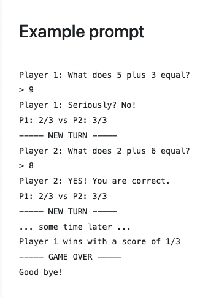

# TwO-O-Player Math Game
An OOP-based command-line application with Ruby.

# Description
A 2-Player math game where participants take turns to answer simple math addition problems. A new math question is generated for each turn by picking two numbers between 1 and 20. The player whose turn it is is prompted the question and must answer correctly or lose a life.

## Details
Both players start with 3 lives. They lose a life if they mis-answer a question. At the end of every turn, the game should output the new scores for both players, so players know where they stand.  The game doesn’t end until one of the players loses all their lives. At this point, the game should announce who won and what the other player’s score is.

## Command Line - Example prompt

## Tasks
  1. Extract Nouns for Classes
  2. Write their roles
  #### Remember that objects are important for two things:
  3. State: Storing data describing themselves (variables)
  4. Behavior: Defining actions that can be performed on them (methods)
  